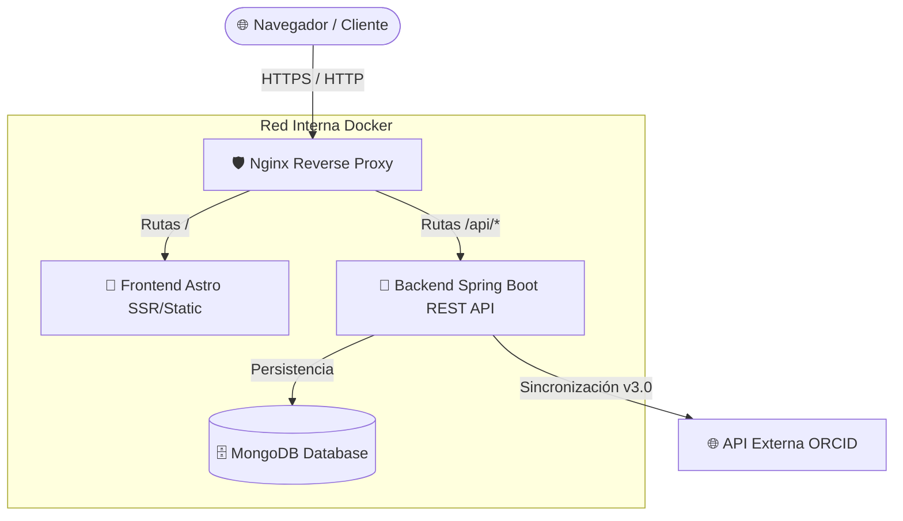

 <div align="right">
   
<a href="https://wakatime.com/badge/github/AdrianBR003/ICARO"></a>
</div>

#  ÍCARO - Portal Web del Grupo de Investigación


Plataforma web *Full-Stack* desarrollada para la gestión, visibilidad y archivo de la producción científica, proyectos de I+D y novedades del grupo de investigación **Tratamiento de Señales en Sistemas de Telecomunicación (TST)**.

El sistema cuenta con sincronización automática de perfiles académicos mediante la **API REST de ORCID**, un panel de administración securizado por **JWT (JSON Web Tokens)** y un despliegue contenerizado preparado para entornos de producción mediante **Docker Compose** y **Nginx**.

---

## Arquitectura del Sistema

El proyecto sigue una arquitectura distribuida y contenerizada. Nginx actúa como Proxy Inverso y punto único de entrada, gestionando las peticiones estáticas/SSR hacia el cliente frontend de Astro y desviando las llamadas a `/api/*` hacia el servidor Spring Boot.



## Tecnologías Utilizadas

### **Backend**
* **Java 17** con **Spring Boot 3.5.3**
* **Spring Security** & **JJWT 0.12.6**: Autenticación y autorización *stateless* mediante tokens JWT
* **Spring Data MongoDB**: Abstracción y consultas para la base de datos NoSQL
* **RestTemplate**: Cliente HTTP configurado con timeouts de resiliencia para la API de ORCID

### **Frontend**
* **Astro 5.11**: Framework híbrido con soporte para SSR y generación estática
* **TypeScript** & **Tailwind CSS v4**: Tipado estático y maquetación ágil responsive
* **Nanostores**: Gestión de estado reactivo liviano para el estado de la sesión (`auth.ts`) y la monitorización de salud del servidor (`backendStatusStore.ts`)

### **Infraestructura y DevOps**
* **Docker & Docker Compose**: Orquestación de servicios e infraestructura como código
* **Nginx**: Proxy inverso, manejo de CORS y servidor web público

##  Estructura del Repositorio

```text
adrianbr003-icaro/
├── docker-compose.yml          # Configuración de contenedores en red aislada
├── nginx.conf                  # Configuración de Proxy Inverso y enrutamiento
├── icaro-backend/              # Aplicación Spring Boot
│   ├── src/main/java/com/icaro/icarobackend/
│   │   ├── config/             # JWT, SecurityConfig, CorsConfig, OrcidClient
│   │   ├── controller/         # Auth, Investigator, New, Project, Work, Session
│   │   ├── model/              # Investigator, New, Project, User, Work
│   │   ├── repository/         # Interfaces MongoRepository
│   │   └── service/            # Lógica de negocio y sincronización con ORCID
│   └── application.properties  # Configuración del servidor y BD
└── icaro-frontend/             # Aplicación Astro
    └── src/
        ├── components/         # Componentes UI organizados por sección (CNews, CPeople, etc.)
        ├── pages/              # Rutas principales (index, news, people, projects, research)
        ├── services/           # Módulos de consulta HTTP al Backend
        ├── stores/             # Nanostores para estado global del cliente
        └── types/              # Interfaces y DTOs en TypeScript
```
## Funcionalidades Principales

1. **Gestión de Personal e Investigadores (`/people`)**:
   * Consulta paginada y filtrado de miembros del grupo de investigación.
   * Importación y sincronización de biografías y publicaciones usando el identificador **ORCID**.
2. **Noticias y Novedades (`/news`)**:
   * Sistema de publicación con soporte para imágenes destacadas y carrusel dinámico en la página principal.
3. **Proyectos de Investigación (`/projects`)**:
   * Registro y visualización de proyectos activados, fechas de ejecución, colaboradores y artículos asociados.
4. **Catálogo de Producción Científica (`/research`)**:
   * Buscador de publicaciones (*Works*) con filtrado avanzado dinámico por **etiquetas**, **títulos** y **proyecto vinculado**.
5. **Panel de Administración (`/admin-login`)**:
   * Acceso restringido para la edición, creación y eliminación en tiempo real mediante modales interactivas habilitadas por rol.

## Endpoints de la API REST

| Módulo | Método | Endpoint | Descripción | Acceso |
| :--- | :---: | :--- | :--- | :---: |
| **Autenticación** | `POST` | `/api/auth/login` | Autentica un usuario y devuelve un token JWT | Público |
| | `GET` | `/api/health` | Verifica el estado del servidor | Público |
| **Investigadores** | `GET` | `/api/investigators` | Lista todos los investigadores | Público |
| | `GET` | `/api/investigators/{orcid}` | Obtiene un investigador por su ID ORCID | Público |
| | `POST` | `/api/investigators` | Crea o actualiza un investigador | Admin |
| | `POST` | `/api/investigators/sync/{orcid}` | Sincroniza datos automáticamente desde ORCID | Admin |
| | `DELETE` | `/api/investigators/{orcid}` | Elimina un investigador | Admin |
| **Proyectos** | `GET` | `/api/projects` | Lista todos los proyectos de investigación | Público |
| | `GET` | `/api/projects/{id}` | Obtiene un proyecto por su ID | Público |
| | `POST` | `/api/projects` | Crea o actualiza un proyecto | Admin |
| | `DELETE` | `/api/projects/{id}` | Elimina un proyecto | Admin |
| **Publicaciones** | `GET` | `/api/works` | Lista las publicaciones con filtros dinámicos | Público |
| | `GET` | `/api/works/project/{projectId}` | Lista publicaciones vinculadas a un proyecto | Público |
| | `POST` | `/api/works` | Registra una nueva publicación | Admin |
| | `DELETE` | `/api/works/{id}` | Elimina una publicación | Admin |
| **Noticias** | `GET` | `/api/news` | Lista todas las noticias publicadas | Público |
| | `POST` | `/api/news` | Crea o edita una noticia | Admin |
| | `DELETE` | `/api/news/{id}` | Elimina una noticia | Admin |

